# [**South Stand Brewery & Taproom**](https://joelmichaelrutter.github.io/south-stand-MS1/index.html)
## Milestone Project 1
### General Purpose and Introduction
This web application is for a fictitious micro-brewery and taproom based in Warrington. The brewery fills a gap in the market as there are limited options for locals to enjoy an intimate and bespoke drinking experience in the town. In addition, most bars in the area tend to be part of a chain - conforming to the stereotypical ‘pub’ image, with limited beer choices and little online presence – therefore missing out a large demographic of younger people. For the South Stand Brewery & Taproom, I wanted to create an enticing, user-friendly site that reflects the following themes -  
1. **Sleek, simple, and professional** – A professional design that will stand out compared to other venues in the sector.  I wanted ease of learning and use and aim to keep it very contained so that it can be used with minimal navigation to other pages.
2. **Robust yet friendly** – The brewery and taproom dynamic would appeal to a ‘hipster’ audience. If you look at other companies that offer the similar dynamics such as Founders Brewing or Brewdog, the typography, copy, images and branding are targeted at their key demographic. Whilst it is important to consider the culture of the audience, one of the business goals of the site is to increase awareness and in course footfall to the venue itself. On that basis, I will be using typography, images, and colour to give the effect of a rugged, no-nonsense bar where beer is the passion, but using calls to action and content to promote a friendly atmosphere.
3. **Enticing** – Normal e-commerce or B2B web applications have a focus on providing a lot of information, or at least having it available to a user if they wish to see it. I will adopt elements of this approach, however, to generate interest and footfall, I wanted to create a site that felt enticing and leave users wanting more through interesting content and tempting background imagery.
## Table of Contents
* ### [Deployed Site](#Deployed-Website)
* ### [Demo](#Site-Demonstration)
* ### [UX](#User-Experience)
* ### [Design](#Design-Features)
* ### [Features](#Functional-Features)
* ### [Technologies](#Technologies-Used)
* ### [Testing](#Application-Testing)
* ### [Deployment](#Deploying-the-site)
* ### [Reflection](#Project-Reflection)
* ### [Further Development](#Further-Development-Scope)
* ### [Credits](#Project-Credits)
* ### [Acknowledgement](#Project-Acknowledgments)
# [**Deployed Website**](https://joelmichaelrutter.github.io/south-stand-MS1/index.html)
By clicking the hyperlinked header above, you can access the final deployed site hosted on GitHub Pages.
# Site Demonstration
## [Am I Responsive?](http://ami.responsivedesign.is/)
Below you can see an image of the final site in the Am I Resonsive tool which shows the fantastic level of responsivity of the site to a number of viewports. Attached the above header is a link to the Am I Responsive tool; should you wish to use it yourself.  
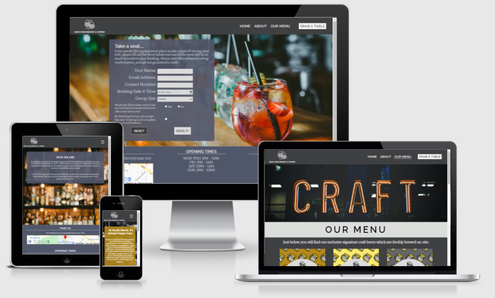
# User Experience
In this section, I will discuss the user experience considerations I implemented during the development process.
## **Strategy**
### **Business Goals**
The promotion of the business’ ethos is important to engage with a user on an emotional level through the content not just design, structure, and layout. The other main goal was to prompt the user to see the business as a positive place where they will enjoy spending time digitally and in person.
The main points I considered during the strategy in terms of the business’ goals were:
* Increase awareness of business and brand.
* Increase footfall in the venue.
* Increase sales of the business’ own craft brewed beer.
* Generate an enticing, exciting environment to leave users wanting to explore the site and increase conversions (booking a table).
### **User Stories**
Below are the user stories that needed to be fulfilled for the project to be successful from the perspective of the user:
* To discover the brand and venue through exciting and adaptive design, ensuring scalability through viewport sizes and on different browsers with no degradation of content.
* To navigate through the site with ease.
* To discover the locally brewed craft beer and drinks menu offered by the business.
* To be able to book a table to guarantee themselves a place to sit when they visit.
* To access key business information such as map location, address, opening times and contact information.
## **Structure Plane**
I originally wanted to keep the site contained to a single page to make it simplistic and easy to use. I began the build by creating a homepage with a few sections underneath – creating a plain but workable site. However, when I experimented with the site in GitPod, I considered my user and what they would expect to see on the page – putting my assumptions aside.  

Professional websites are often compartmentalised to prevent an information overload for the user. With this in mind, I split the site into its respective pages. This also enabled me to develop some navigation functions to provide visual feedback, in the form of a bottom border, to easily identify to the user which page they were interacting with. With the user in mind, to complement the user-friendly navigation, I wanted to create a consistent, visual journey throughout the site – choosing a background image, with both in focus and out-of-focus elements, to add to the theme of enticement. 
## **Skeleton Plane**
There were two stages to the skeleton process:
1. I started by drawing some basic concepts of what I wanted the site to look like on desktop and mobile, images of the drawings can be found below:
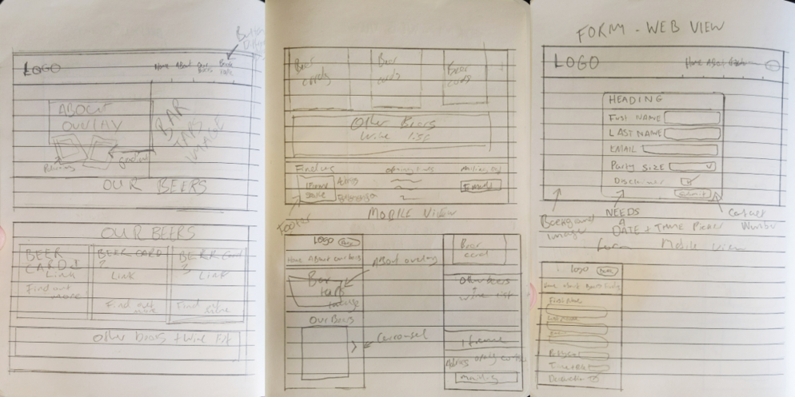
2. After drawing up some basic concepts, I refined the concept further by using [Miro](https://miro.com/login/). Below you will find the links to images of my wireframes:
   * [Large Screens](assets/read-me-images/large-screen-miro-wireframe.png)
   * [Tablet Screens](assets/read-me-images/tablet-mire-wireframe.png)
   * [Mobile Screens](assets/read-me-images/mobile-miro-wireframe.png)
# **Design Features**
## **Colour Choices**
The colour palette for this project was developed in line with the themes of the site, to recap those themes are:
1. Sleek, simple, and professional 
2. Robust yet friendly
3. Enticing  
You can explore my colour palette in the image below:
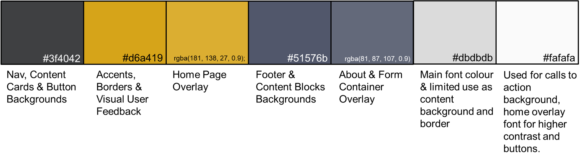
I used the above colour palette to make the design accessible - always using the lighter shades on darker backgrounds as my main font colour. This also added to the professional feel of the page and preventing jarring contrasts.  
Below you will find in-depth considerations about the colour selection and the themes the colours promote -  
* #### **(#3f4042)** - To reflect my first two themes, I chose a sleek, dark grey to serve as the background colour of my navigation bar which is arguably one of the most important elements displayed on the site, as it appears on all pages and has a high degree of importance to the user due to its function. For consistency, I also introduced this colour into other elements such as content cards, containers, and buttons.
* #### **(#d6a419)** – Whilst it is important to have a professional feel to the website, I wanted to deliver the theme of friendliness and introduce a community-feel for the user. I chose a warm orange to contrast and complement the dark grey. I also chose this colour based on its similarity to the colour of pale ale which is one of the main products sold by the business. I used this colour on the pseudo class for my navigation links so that when the user hovers over the link, the colour of the text turns from very light grey to orange providing visual feedback as to what function the user is completing. 
* #### **RGBA (181, 138, 27 0.9)** – To ensure consistency, I used a [HEX to RGBA converter](http://hex2rgba.devoth.com/) to convert my orange hex colour into a RGBA value. I lowered the alpha value ever so slightly and used it as the background colour for my homepage overlay. This allows my enticing home background image to be seen through it without degrading the contrast or readability of the overlay.
* #### **(#51576b)** – I wanted a clear difference between my dark grey navigation bar and the footer of the page, so I chose a complementary turquoise colour. This tone combined with the colour of the font creates a nice balance of contrast, making it easy to read but not so much that the contrast in colours is jarring.  
* #### **(#dbdbdb)** – I introduced the smoky, light grey to add to the alluring theme of the site. As mentioned above in terms of font colour, it makes for an excellent balance of contrast and is pleasing to the eye. I also used this colour as a container background colour to contrast against my main dark grey as an almost semantic indication that the content is changing.
## Typography Choices
For the project, I used two fonts imported into my CSS file from [Google Fonts](https://fonts.google.com/). They were selected in line with the overarching themes that I wanted to achieve. The fonts I chose, examples and explanations are detailed below:
### **Raleway** 
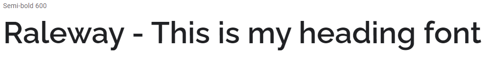  
I chose Raleway as its smooth and modern tone reflected the themes for my project.
### **Bitter**
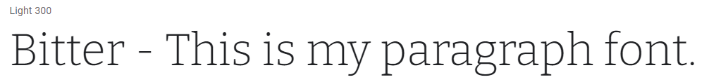  
I chose Bitter in line with my other theme – robust yet friendly. The font looks more organic and handwritten, similar to how a bar menu would be written on a chalkboard. It also complements Raleway’s modern feel.
## **Imagery and Media**
I obtained my images from a few different sources. Like all the selections so far, be it colours or fonts, I wanted the imagery to play into the themes of the site. The imagery in the project provokes a positive user response in line with the enticing theme of the site, without detracting from the content within the pages. 
All the images have a consistent feel with in-focus and out-of-focus elements. All images of unsuitable size were resized and compressed to ensure a good level of performance. Below you will find a full breakdown of the images used throughout the project.  
### **[Wix Logo Creator](https://bit.ly/3vx0UI5)**   
I used the wix logo creator to create the bar’s logo which is displayed in the nav bar and the beer label images contained in the Our Menu page. The logo has a neon bar sign feel which promotes the purpose of the page.
### **[Unsplash Stock Images](https://unsplash.com/)**   
* #### **[Homepage Background Image](https://bit.ly/3v29Pks)**
The South Stand Brewery & Taproom is an alternative experience in Warrington to your usual pub. The bar taps background image promotes the purpose of the site to the user. The site is for a taproom, so the user sees beer taps and a beer being poured as soon as they visit the site. The amount of taps displayed in the image signals to the user that there is a lot of choice in terms of drinks offerings provided by the business, which is inline with the business’ goals of standing out from the rest of the businesses in the area. The black and white tone of the picture and the out-of-focus elements entice the user to learn more and by doing this, it increases the chances of the user visiting the bar.
* #### **[Our Menu Page Top Image](https://bit.ly/3v1W9pq)**
The image at the top of the Our Menu page plays into the bar signage element in line with the business logo, it is hazy in nature and displays a neon sign, with the word, ‘Craft’. This indicates to the key demographic of the site that this is where you can find craft ale locally. The warm tone of the sign leans into the friendly theme of the site. 
### **[Shutterstock](https://www.shutterstock.com/home)**
* #### **[About Page Backround Image](https://shutr.bz/3ynUInf )**
On the About page, I chose an image with more neutrality so it wouldn’t detract from the content. The purpose of the page is for the user to learn about the ethos, attitude, and history of the business so the content is king here. In saying that, the image still signals to themes of the site with an out-of- focus bar displaying many alcoholic beverages indicating to the user that there is a lot of choice, but the out-of-focus nature entices the user to pay a visit to the bar. The friendly theme of the site and venue comes through via the warm vintage lighting displayed in the foreground of the image – indicating an exciting, vibrant atmosphere. 
* #### **[Grab a Table Page Background Image](https://shutr.bz/3woD9lr)**  
The image shows drinks lined up on a table which holds semantic relevance to the purpose of the page which is to book a table at the venue. Again, the image has in-focus and out-of-focus elements to entice the user. The interplay between the positioning and colour of the form container, fonts, and background image create an aesthetically pleasing visual journey for the user.
### **[Canva](https://www.canva.com/)**
I used a Canva template to create the beer label images and added my logo. Once I had the beer labels coloured and holding the correct text content, I cropped the images for use within the beer card divs. Links to the shared documents can be found below:
* **[Sin Bin Pale Ale Image](https://bit.ly/3hCP1vM)**
* **[40/20 Pilsner Image](https://bit.ly/3yox6im)**
* **[Scrum Milk Stout Image](https://bit.ly/3yp2c9K)**
## Inconography Choices
I used iconography from [Font Awesome](https://fontawesome.com/). I decided to limit my use of iconography throughout the site as I felt from a user perspective the site achieved what it needed to without the widespread use of icons. I chose consistently styled social media icons for Facebook, Instagram, and Twitter – positioning them below the contact details section of the footer as this is where the user would expect to see them, therefore, increasing my success of the user following the business on social media. 
# **Functional Features**
Below I will list the application's features from the intended perspective of the user, (links to the corresponding page inside the site are implemented inside the headings) - 
### **[Index Page](https://joelmichaelrutter.github.io/south-stand-MS1/index.html)**
* **Navigation Bar** - The navigation is positioned at the top of viewport on all device sizes. The navigation is consistently styled throughout every page. When displayed on a laptop or desktop, the content is displayed inline. For the mobile and tablet view, the use of CSS media queries calls alternative styling with a hamburger menu and a collapsible block navigation menu. The content displayed within is as follows:
* **South Stand Brewery & Taproom Logo** – This operates as a link to the homepage as is the norm with many other web applications.
* **Home Navigation Link** – This serves as a link to the homepage and is in place for users that may be unfamiliar with the norms of web user experience.
* **About Navigaton Link** – This navigation link takes the user to the about.html page where they can learn about the history, attitude, and ethos of the business. 
* **Our Menu Navigation Link** – This navigation link takes the user to the drinks menu page where they can discover the various craft beers brewed by the business and the products offered at the taproom.
* **Grab a Table Navigation Link** – One of the main goals of the business is to increase footfall. I styled this navigation link more specifically within CSS, using inverted colours to make it clear as a call to action button, making it stand out. Using inverted colours and isolating it with wider margins from the rest of the links increases the chances of the users’ eyes being drawn to it, therefore if they are more likely to see the link then it should help me achieve my goal of increasing footfall. Clicking this link takes the user to the form.html page where they can use a html form to submit a booking request.
* **Home Overlay** – One of the bar’s themes is friendliness so I used the homepage overlay to inject some warmth into the page and provide a little bit more information about the business. The themes of robustness, sleekness, and professionalism come through via the design, colour and imagery but I thought it was important to create some content in line with the businesses themes to resonate with the user on an emotional level displayed at the start.
* **Footer** – The footer is consistent across all pages and is almost always partially revealed when the user lands on any page - prompting a positive experience as it isn’t taking up too much room on the page, preventing an information overload, or covering up the key information about the beer selection or how to book a table. However, within the footer there are three sections containing important business information, so I have built the footer in a way if the user scrolls ever so slightly downwards, they can still interact with the page but also get the important business information they require with minimal effort. 
   * **Find Us Footer Section** - This section enables the user to find the address of the bar with a Google Maps iframe which when clicked, opens Google Maps with the address pinned on a separate tab or in the mobile application – making it easy for the user to plan their journey.
   * **Opening Times Footer Section** - This section enables the user to find the business’ opening hours.
   * **Contact Us** – This footer section provides the user with a contact email address and telephone number for the business. Due to the nature of social media often being used as a primary channel of contact, I included three social media icons from Font Awesome as links to the business’ social media channels underneath.
### **[About Page](https://joelmichaelrutter.github.io/south-stand-MS1/about.html)**
* **About Page Overlay** - The about overlay is in place to inform the user about the history, ethos, and attitude of the business. The content contained within is the focus of this page.  
### **[Our Menu Page](https://joelmichaelrutter.github.io/south-stand-MS1/menu.html)**
The Our Menu page contains several sections where the user can discover the beers, cocktails and drinks offered in the taproom and their prices. Throughout all the menu content, the written text has been designed to embed with the themes of the site, it is informal, friendly, and enticing. Below is a breakdown of the content:
* **South Stand Craft Beer section** – To meet the business goal of increasing the sale of its own beer, the first section of content the customer can see when they scroll is the South Stand Craft Beer selection. This section enables the user to discover the brand in more detail. The brewery is currently producing three separate craft beers. They are split into three cards - positioned inline at equal intervals: Sin Bin Pale Ale, 40/20 Pilsner and Scrum Milk Stout. The positioning of the section is above the other offerings giving it higher semantic value than those below – hopefully increasing sales by highlighting the business’ unique selling point. The section has a container with a background colour which features the same grey colour of the navigation to create a link.
* **Other Drinks Menu section** – To appeal to a wider user base, the additional drinks offered by the business are detailed in the section below the South Stand Beer Section. To contrast, I set the container background colour for the other drinks’ cards to that of the main font colour. The contrast is not jarring, is pleasing to the user’s eye and most importantly, is clear to read. I set the background colour of the other drinks’ cards to that of the footer for colour consistency throughout the page. The other drinks offered by the business are split into four cards going left to right in order of business preference:
    1.	**World Beer Card** – First is the world beer card which provides the user with information about the excellent cultivated beer offerings other than the business own brewed craft beer. 
    2. **Spirits Card** – In this card, the user can view the wide selection of spirits available at the bar.
    3. **Cocktails Card** – In the cocktails card, the business appeals to a wider user base as users who may not be interested in beer can see that the business can cater for them.
    4. **Wine and Soft Drinks Card** – Finally, we have the wine and soft drinks card. The business has three wines displayed as ‘top picks’ and a selection of soft drinks which again opens the business up to a wider user base. 
### **[Grab a Table Page](https://joelmichaelrutter.github.io/south-stand-MS1/form.html)**
On this page, the customer can use a html form to book a table for their visit. In the element, I set the method to GET to prevent a 405 error. On a real, live site this would be set to POST when integrated with a backend system and database. The form is positioned in such a manner to compliment the background image of the page. The header content on the form is inviting and enticing to the user further promoting the business themes. All form inputs are validated to ensure that the data collected is fit for purpose. The inputs inside the form are as follows:
* **Name (text input)** – For the business to learn the customer’s name.
* **Email address (email input)** – So that the business has a channel of communication with the user and can confirm bookings.
* **Contact Number (number input)** – So that the business has a channel of communication with the user and can confirm bookings. I prefixed this input in my CSS code to remove the counter at the side of the input to prevent a negative user experience if the customer clicked it once they had entered their number.
* **Booking Date and Time (datetime-local input)** – This input opens a date and time selector so the user can select when they wish to visit.
* **Group Size (select input)** – This allows the user to select how big their group size is and is also beneficial information for the business so that they can understand whether they can facilitate the booking. There are several options to choose from to make filling the form in easier for the user and provides more valid data to the business.
* **Mailing List Opt-In (radio button group)** – In line with the business goals of generating an exciting community of locals with the bar at the centre, the user has a chance to opt-in or out of further communications. I originally planned for one of these to be checked by default but then considered, if this were a real site, I would have to consider GDPR concerns as well as the user experience. If I had kept it how it was, the user would have unknowingly consented if they only glanced over the question. The input is set as required so the user must read the label and decide whether they would like to be contacted.
* **Booking Confirmation Disclaimer (checkbox input)** – This input field allows the business to set expectations to the user regarding their booking and asks them to confirm that they understand that without booking confirmation, they are not guaranteed a table.
* **Reset Button (reset input)** – The reset button allows the user to reset the form if they make a mistake or their browser fills in information automatically. This button has a pseudo hover class applied to it to change the colour and provide visual feedback to the user as to what they are doing.
* **Send It! Button (submit button)** – Finally, we have the submit button. This is styled in opposite colours to the reset button and has a pseudo class applied to change its colours when the user hovers over it to provide visual feedback to the user. The positioning of the send it button on the right is its natural place from a user perspective as we read in English from the left to the right, so the submit button should be the final thing the user looks at.
# **Technologies Used**
Below I will list the variety of technology I used during the development process:
### **Operating Systems**
* **[Windows 10](https://www.microsoft.com/en-gb/windows/get-windows-10)**
* **[Mac OSX Mojave](https://en.wikipedia.org/wiki/MacOS_Mojave)**
### **GitPod** - was used as an Integrated Development Environment.  
### **Languages**
* **[HTML5](https://en.wikipedia.org/wiki/HTML5)**
* **[CSS3](https://en.wikipedia.org/wiki/CSS)**  
### **Frameworks**
* **[Google Fonts](https://fonts.google.com/)** - for typography
* **[Font Awesome](https://fontawesome.com/)** - for iconography  
### **Version Contol**
* **[Git](https://en.wikipedia.org/wiki/Git)** - was used as a version control system.
* **[GitHub](https://en.wikipedia.org/wiki/GitHub)** - was used as a code repository and deployment platform.  
### **Wireframes**
* **Pencil & Paper** - for original concept drafts.
* **[Miro](https://miro.com/login/)** - Was used to advance my wireframes and concepts in a digital space.  
### Other
* **[Can I Use?](https://caniuse.com/)** - To understand browser compatability and help with testing.
* **[Colourspace](https://mycolor.space/?hex=%233F4044&sub=1)** - For help with choosing a colour palette, specifically the twisted spot palette.
* **[Online Image Resizer](https://resizeimage.net/)** - For reducing image size in terms of resolution and compression.
* **[Image Compressor](https://imagecompressor.com/)** - For compressing images without resizing.
* **[Iframe Generator](https://html-css-js.com/html/generator/iframe/)** - Used to generate an iframe element for my footer.
* **[Microsoft Word](https://en.wikipedia.org/wiki/Microsoft_Word)** - Used to write the initial README and TESTING documents. 
* **[Microsoft Forms](https://forms.microsoft.com/)** - To create my user testing feedback form.
* **[Microsoft Excel](https://en.wikipedia.org/wiki/Microsoft_Excel)** - To create my manual testing spreadsheet checklist.
# **Application Testing**  
Please click [here](testing.md) to see a full breakdown of all testing completed on the application.
# **Deploying the site**
The finalised version of the site is deployed on GitHub Pages. Here are the steps I followed to deploy the site:
1.	Login to [GitHub](https://github.com/) and locate the [south-stand-MS1](https://github.com/JoelMichaelRutter/south-stand-MS1) repository.
2.	In the top menu of the repository, select the settings option.  
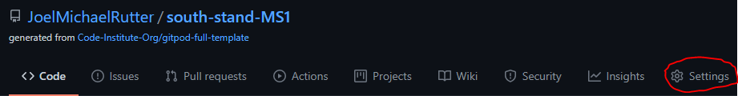
3.	Scroll down the settings page until you find the GitHub Pages option and click it.  
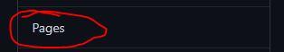
4.	On the GitHub pages section, locate the dropdown that displays the word “None”. Click the dropdown and select the “Master” or “Main” branch.  
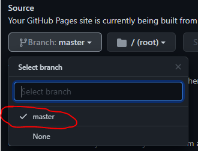
5.	The page will refresh automatically and provide a link to the deployed site in the uppermost section. Click this link to load the deployed site.  
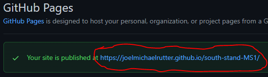
6.	If the site does not display straight away, it may be because GitHub pages is preparing the site, wait for a few minutes and follow the previous step again.
## **Forking the repository**
Should you wish to use the site code inside the repository without affecting the original repository, you can make a fork and create a copy of the repository which you can view and amend the code within. To create a fork, follow these steps:
1. Login to [GitHub](https://github.com/) and locate the [south-stand-MS1](https://github.com/JoelMichaelRutter/south-stand-MS1) repository.
2. In the top right-hand corner of the repository, you will see three buttons just below your profile icon. The rightmost button is called “fork”. Click this button.  
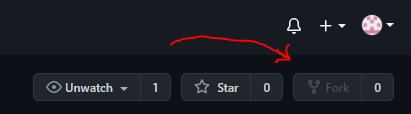
3. The repository will now be copied to your own GitHub account.
## **Cloning the repository**
You can create a clone of the repository inside your development environment. To do this, follow these steps:
1. Login to [GitHub](https://github.com/) and locate the [south-stand-MS1](https://github.com/JoelMichaelRutter/south-stand-MS1) repository.
2. Whilst in the repository, you will see the various files contained within. Above this list, you will see a button labelled “code”. The button will have a small download icon beside it.  
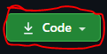
3.	When you click this icon, a small dropdown will open. Inside the dropdown will be the URL for the deployed site. Copy this URL by clicking the clipboard icon.  
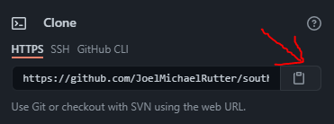
4.	Open the Git Pod integrated development environment. 
5.	Whilst in the development environment, navigate to the bash terminal.
6.	In the bash terminal, enter “git clone”, then paste in the URL copied from the GitHub repository and hit enter.
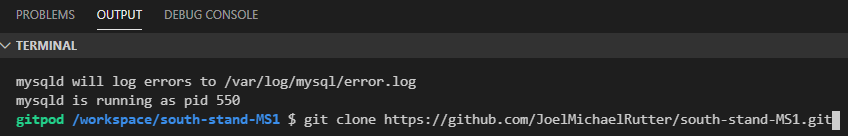
7.	A clone of all files will now be pulled into the workspace.
# **Project Reflection**
I have really enjoyed the project despite some of blockers and challenges, and I am really pleased with the result. The site looks polished and how I imagined it before I started so it’s brilliant to see how it has come together, utilising the skills I have learnt on the course, and from my extracurricular reading and research.  I have a few considerations that I would like to share about the development process.  
* If I was to do this again, I would 100% use a responsive framework such as CSS flexbox, grid, or Bootstrap. Making the site respond to a variety of devices was challenging without the use of such frameworks. Despite this, I think that the traditional approach benefitted me in terms of browser compatibility as prior to the testing stage, I was testing in different browsers with very few, if any, compatibility issues. I look forward to using responsive frameworks in my future projects. 
# **Further Development Scope**
I will continue to revisit this code as I develop further to apply my new skills. There are a few specific considerations that I would like to voice:
* I would like to include more scope for user interaction which I think I will develop with the JavaScript module coming up. One thing that I really wanted to do was have detailed beer profiles appear on the opposite sides of the beer cards which would flip over when the user interacted with them.
* I know that there are some minor issues with browser compatibility, specifically with Internet Explorer. The only issue is the date and time picker on the form doesn’t have the same functionality inside Internet Explorer. I have researched this, and I think the problem can be solved using JQuery and patched in a later release. I’m not particularly worried about this compatibility issue as research shows that as of 2021, the most popular browsers are Google Chrome, Safari, Samsung Internet and Firefox Mobile within which the input works as intended.
* I would develop the form further to provide a submission successful or unsuccessful message to the user for further visual feedback. 
* Based on user feedback, I would also develop a gallery of images and add it as an extra page to provide users with some visual reference of what the venue looks like to aid in location and add to the enticing theme of the site.
# **Project Credits**
## **Content**
* **[Vox Bar, Huddersfield](https://www.facebook.com/VoxBarHuddersfield/)** - For the general idea of creating a bar and their amazing cocktail recipes.
## **Code**
* **[Code Institute’s Full Stack Software Development Course](https://codeinstitute.net/)** - For there course modules so that I could skip back and review course content to help me.
* **[Stack Overflow Community](https://stackoverflow.com/)** - For helping me find my way around problems and suggesting fixes.
* **[W3 Schools](https://www.w3schools.com/)** - For serving as a quick dictionary of declatations and values. And also their page on removing arrow spinners from number inputs [here](www.w3schools.com/howto/howto_css_hide_arrow_number.asp).
* **[Caler Edwards](https://www.youtube.com/watch?v=xMTs8tAapnQ)** - For his video tutorial on creating a pure CSS responsive navigation menu (styles implemented were my own).
* **[Stephen Keable](https://stephenkeable.medium.com/iphone-safari-changing-colour-of-phone-numbers-b79e5139cc06)** - For his code which helped me remove the Safari defealt styling on my phone number but not the click to call functionality.
# **Project Acknowledgements**
* **The Slack Community** - For letting me bounce bits of code off them and for exposing me to new ways of doing things.
* **Code Institute Tutor Support** - For pushing me in the right direction with tricky bugs.
* **My Partner** - Charlotte Howard for her marketing genius and helping me write copy that wasn't total rubbish.
* **My Mentor** - Chris Quinn for his helpful feedback, coding genius and for being all-around sound guy.