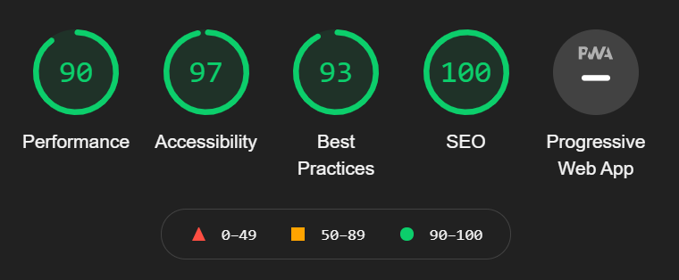
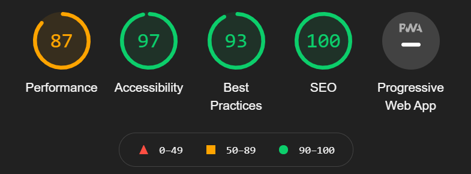
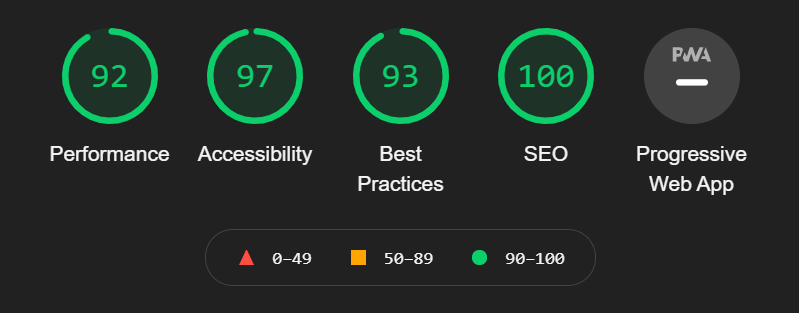
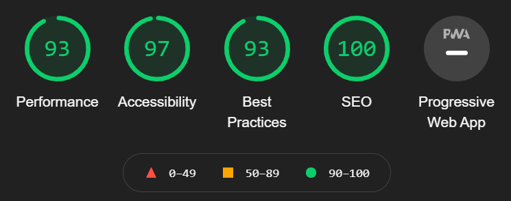

# **South Stand Brewery & Taproom Testing Document**
## **Issues During the Development Process**
1. One of the most significant and by all accounts frustrating bugs that I encountered during the development of the page was the mobile navigation. When the mobile navigation was opened upon clicking the hamburger menu, the content would be pushed down and the mobile navigation would be layered improperly. The bug was very persistent, but I finally found that changing my page content positioning to absolute, positioning the element back in the same place and adding relevant z-index’s to both the navigation menu element and the content solved the problem. 
   * The problem was so persistent that I only managed to add a fix on all of pages right before finalising my testing.md file. The issue persisted on the menu page and whilst it didn’t affect the content too badly, it was ruining the polish of the site. I finally fixed it by adding an absolute position to the menu element inside the mobile and tablet media queries and then repositioning it to drop down on the right-hand side of the screen.
2. Towards the end of the development process, I started to validate my HTML & CSS so that I could see how much I would need to change, and factor this in before finalising my code. Below are some of the validator errors I encountered. (I fixed prior to detailing my testing process but can be seen in my commit history):
  * **Spans** - When I began to make the site respond, I used span elements as my page overlays in an attempt to make them responsive and allow the content to control the element's height. This in turn caused an error to show up in the validator. To fix the issue, I simply applied the stylings to the section containing the span and removed the span element. The pages work in the same way and the error in the validator is no longer present.
  * **Iframe** - I encountered an error doing something in line with the course content as the HTML validator stated that I wasn’t allowed to insert text in any context between the iframe opening and closing tag. To get around this and display something for browsers where iframes are not supported, I consulted tutor support. They advised me to write some more text inside the section and use positioning and z-index to hide the text behind the element on all viewport sizes. I copied the text outside of the iframe element and added some specific styling to tag to position it behind the iframe, changing the positioning in the relevant media queries to ensure that it wasn't hanging out of the border. The text is in the correct position as when the page loads, you can see it briefly as the iframe loads in. I encountered a few iframe validation issues on account of the inline stylings applied to the element, as the element was already styled by CSS, removing them did not cause any issues and fixed the obselete styling error in the browser.   
Other than the issues presented above, the only other errors I had were due to stray empty attributes and closing tags. I resolved these errors by removing them.  
# **User Stories Testing**
For ease of reference, I will display the user stories and an explanation of how these stories have been fulfilled below:
* **To discover the brand and venue through exciting and adaptive design, ensuring scalability through viewport sizes and on different browsers with no degradation of content.**
   * Later in this document you will encounter a full set of cross device and browser manual testing checklists to show that the design and layout is adaptive, and no content degrades across viewport sizes. 
   * Further down the document, you will find a set of user feedback I collated based on these user stories tested by various colleagues from my workplace on their devices and on different browsers.
   * We read from right to left and top to bottom, so at the top left of the page, the businesses logo is displayed immediately introducing the user to the brand.
* **To navigate through the site with ease.**
   * As soon as the user arrives on the website, the first thing at the top is the navigation bar with contrasting navigation links. I used a technique I admired from the love running project by adding a “link-active” class to the active link on each page to provide visual indication to the user as to what page they were viewing currently. Further visual feedback is provided to the user with the use of a pseudo class on the navigation links so that when the user hovers over the link or presses it on a mobile device, a border appears underneath and the text colour changes to orange.
   * The navigation bar is consistent across all pages regardless of the device ensuring a consistent visual user journey and ease of learning.
* **To discover the locally brewed craft beer and drinks menu offered by the business.**
    * On the “Our Menu” page, by order of precedence, the first thing the user sees when they scroll to explore the content is an explanation of what the user is seeing and then brightly coloured beer labels. The order of the content is important here as it forces the user to view the business' own craft beer before they can view what else the business has to offer.
* **be able to book a table to guarantee themselves a place to sit when they visit.**
   * Inside the navigation menu, the “Grab a table” link is offset with wider margins and emphasised with alternative/ reversed colour styling. Clicking the grab a table button takes the user to the form.html page where they can use a HTML form to book a table for their visit. 
* **To access key business information such as map location, address, opening times and contact information.**
   * The business-critical information to the user is displayed in the footer which is the norm in terms of information layout and is what is expected by users. This is confirmed in my user testing.   

In addition to the above, I completed some limited user testing where I provided the site to a sample of my work colleagues and asked them to answer some feedback questions. You can see the answers by navigating to the spreadsheet attached [here](link to spreadsheet).  
# **Functionality and Compatability Testing**
Please click [here](link to spreadsheet) to access the spreadsheet checklists for full details of all manual functionality and compatibility testing completed across a range of devices. To summarise the manual testing, the website has been tested by myself in both portrait and landscape mode on the following devices, browsers & operating systems:
* Google Pixel 3 – Google Chrome, MS Edge, Firefox – Android 11
* Motorola Moto G7 – Google Chrome, MS Edge, Firefox – Android 10
* iPhone 6 Plus – Safari 12 – iOS 12.2.5
* iPad 6th Gen - Safari 14 - iOS 14.4
* HP Elitebook – Google Chrome, Firefox (edge and IE were blocked as it is a work laptop)– Windows 10
* Macbook Pro 13” – Google Chrome, Safari – Mac OSX Mojave
* Dell Inspiron Laptop – Google Chrome, MS Edge, Internet Explorer, Firefox – Windows 10
* AOC Desktop Monitor – Google Chrome, Firefox (edge and IE were blocked as it is a work laptop) – Windows 10  
The site has also been tested inside Google Chrome dev tools and is fully responsive to all device sizes. In conclusion, the website whilst not written in a responsive framework the site is:
* Cross compatible across device sizes as demonstrated through manual testing and in dev tools. 
* Cross compatible across browsers as demonstrated through manual testing - one caveat here is that the datetime-local input field is buggy on older versions of Safari and not compatible at all by IE and Firefox for desktop. Despite this, the input does downgrade to a text field which still allows input it just means the data submitted by users on this browsers will be inconsistent with those that use Google Chrome or Edge where the feature is supported. 
* Cross compatible across operating systems as demonstrated by manual testing.
# Performance Testing
To test the performance of the website, I used Google Lighthouse inside Chrome Dev Tools. Below I will outline each pages performance with screenshots of the lighthouse reports:
## index.html  
  
## about.html

## menu.html

## form.html
  
# Code Validation
All of the HTML and CSS code was validated in the w3c [HTML](https://validator.w3.org/#validate_by_input) and [CSS](https://jigsaw.w3.org/css-validator/#validate_by_input) validators via direct input. All code passed with no errors but some warnings due to vendor prefixes.

